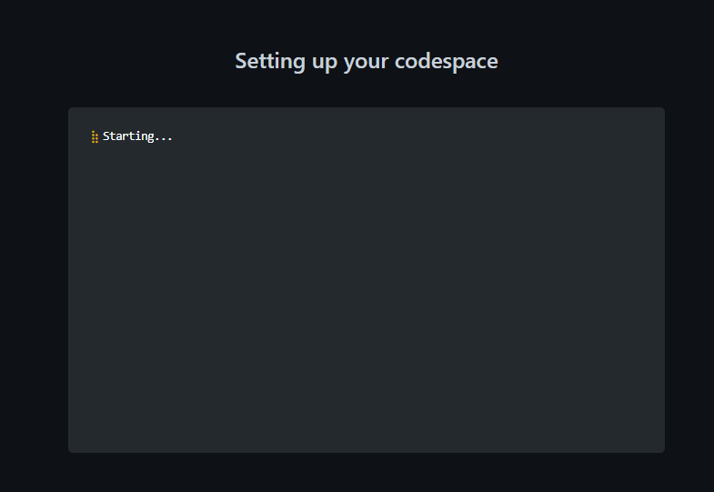

# Welcome

Welcome to Data Analysis Fundamentals.

This github repository is your personal course repository.

It is only accessible by yourself and the class teacher.

If you want to make this repository visible to colleagues or potential recruiters, you can make this repository public by clicking on Settings, scrolling down to the bottom of the page then changing the visibility to "Public".

# Python and Jupyter Notebook

This course is a hands-on introduction to data analysis using the programming language Python. Python was invested by Guido van Rossum and -together with R - is the most widely used language for data analysis.

For this course, we will use Jupyter Notebook. Jupyter Notebook is a web-based computing platform which allows you to combine coding, documentation and visualization thus making it an ideal environment to learn by doing.

# How to pass this course

In order to pass this course, you will need to complete 4 homework assignments (week1, week2, week 3, week 4) and submit a personal course project.

## Weekly homework

Each homework assignment contains scalable difficulty tasks designed to support your individual learning objectives.

To pass the class, you "only" need to complete the TODOs marked with a broccoli: :broccoli:

The TODOs marked with 1 :hot_pepper:, 2 :hot_pepper: :hot_pepper: or 3 :hot_pepper: :hot_pepper: :hot_pepper: hot peppers are optional.

## Personal course project

For your personal course project, you need to bring your own data - ideally data from your work or field of study. You should be familiar with the data domain. The source data for your project can be csv, xls, txt, xml, json or any proprietary text format. Your dataset can consist of 1 or several files and should contain at least a few thousand rows of data.

Even though your course repository is private, your teacher will gladly sign an NDA, should you require it in order to use your data for the course.

# Getting ready

You need to bring your own laptop to class everyweek. 
Your laptop can run Windows, MacOS or ChromeOS.
Your laptop should be connected to the internet. More specically, you need access to the following web sites:
- github.com
- github.dev
- data.world

Your github repository includes a Python environment which you use online without having to install any software on your laptop (see "launch your codespace).

## Optional

You can also setup Python on your laptop. If you decide to install Python on your laptop, the easiest is to install the Anaconda distribution.

see https://www.anaconda.com/products/distribution

# Launch your codespace

Follow the steps below if you want to use the github codespace cloud environment to work on your project.

Otherwise, you can work on your local laptop environment and upload your homework and project files using the add file button (or via github commands).

1. Under the repository name, use the Code drop-down menu, and in the Codespaces tab, select "Create codespace on main".

2. Wait as Github initializes the codespace:
  
 

